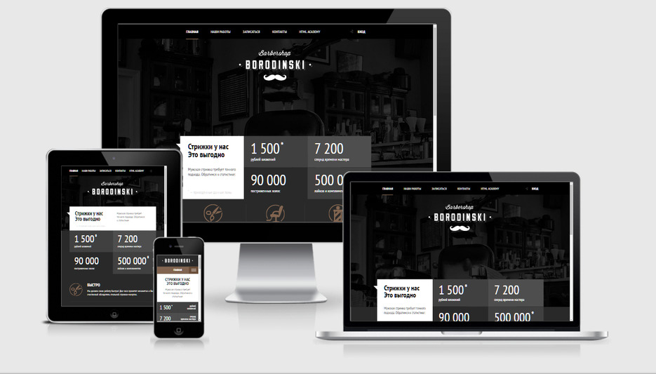

# Проект «Barbershop»

* Вёрстка: [Виталий Дубинка (Pixel-Man)](https://github.com/Pixel-Man).
* Макет: [HTML Academy](https://htmlacademy.ru).
* С реализованным проектом можно ознакомится по [ссылке](https://pixel-man.github.io/Barbershop/).

## Описание
Проект «Barbershop» был выполнен в рамках пройденного онлайн‑курса «Продвинутого HTML и CSS» от HTML Academy.

* Используемые технологии: _HTML, CSS, БЭМ, JS, Адаптивный дизайн_.
* Фреймворки: _нет_.
* Препроцессоры: _LESS_.
* Автоматизация: _Grunt_.

